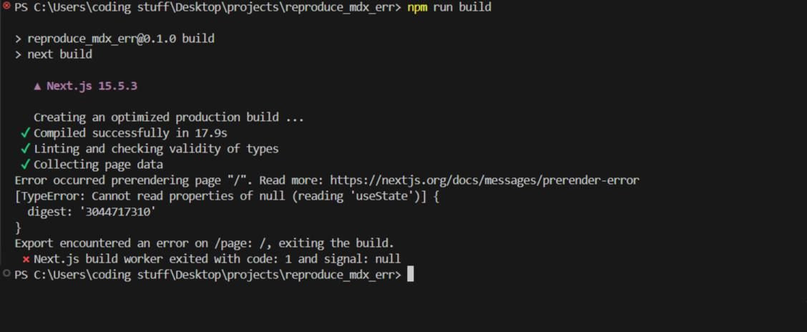

# Reproducing my mdx-bundler error from https://github.com/kentcdodds/mdx-bundler/issues/242
- mdx is bundled in ./app/page.tsx
- getMdxComponent is called in ./app/DisplayMdx.tsx

# To run it yourself:
1. clone the repo
2. npm install
3. npm run dev to see behavior in dev server
4. npm run build to see build error

## In dev mode
https://github.com/user-attachments/assets/b38ed083-3101-47ed-9d33-c40f39b1d546

## Attempting to build

update: In next js 15.3.3, the build would succeeed, but navigating to the page
rendering the mdx would result in a 500 internal server error, with the same error as above in
the terminal.
This is next js 15.5.3

